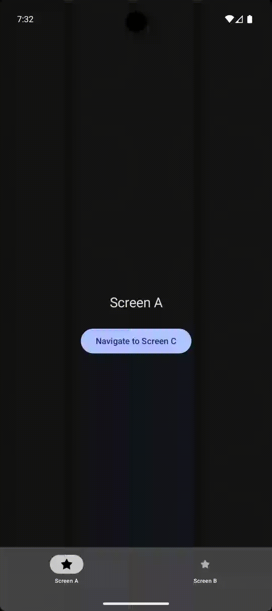
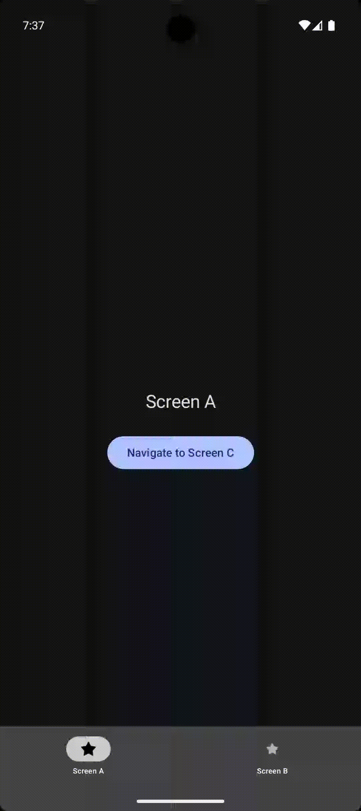

# Navigation 3 Compose

This repository provides a step-by-step tutorial for the new Navigation 3 library in Jetpack
Compose. The project includes:

- Basic setup for the Navigation State and Navigation system.
- Navigation integration with a Bottom Navigation bar.
- Screen transition animations, including global and per-screen configurations.
- Adaptive navigation support for different screen sizes and layouts.

---

# Navigation Example

This example demonstrates the following navigation paths:

- **Bottom Navigation**:
    - 📱 -> **Screen A** & **Screen B**
- **From Screen A**:  - ➡️ -> **Screen C**
- **From Screen B**:  - ➡️ -> **Screen D**

---

# Examples

|                     Example 1 - Navigation 3                      |                    Example 2 - Navigation 3                    |                         Example 3 - Navigation 3                          |
|:-----------------------------------------------------------------:|:--------------------------------------------------------------:|:-------------------------------------------------------------------------:|
|  |  |  |
|                  *Navigation without Animation.*                  |                  *Navigation with Animation.*                  |                  *Navigation supports Adaptive Screens.*                  |

---

# Article

> [!IMPORTANT]  
> Check my article for the setup :
> point_right: [Navigation 3 - The new navigation for Jetpack Compose - Medium](https://medium.com/@nicosnicolaou/navigation-3-the-new-navigation-system-for-jetpack-compose-6dd26313aed6) :point_left:  

---

# Versioning

Navigation 3 version: 1.0.0  
Target SDK version: 36  
Minimum SDK version: 29  
Kotlin version: 2.2.21  
Gradle version: 8.13.1  

---

# References

- https://youtu.be/6L6GfvlmKj8?si=QFvKUxKXNmpY2oY9
- https://android-developers.googleblog.com/2025/11/jetpack-navigation-3-is-stable.html
- https://developer.android.com/guide/navigation/navigation-3