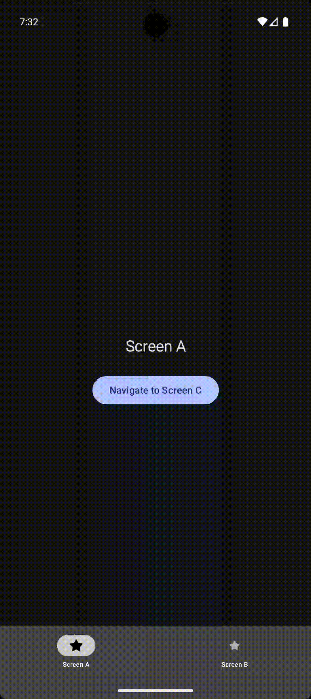
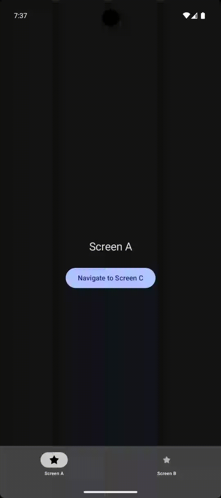
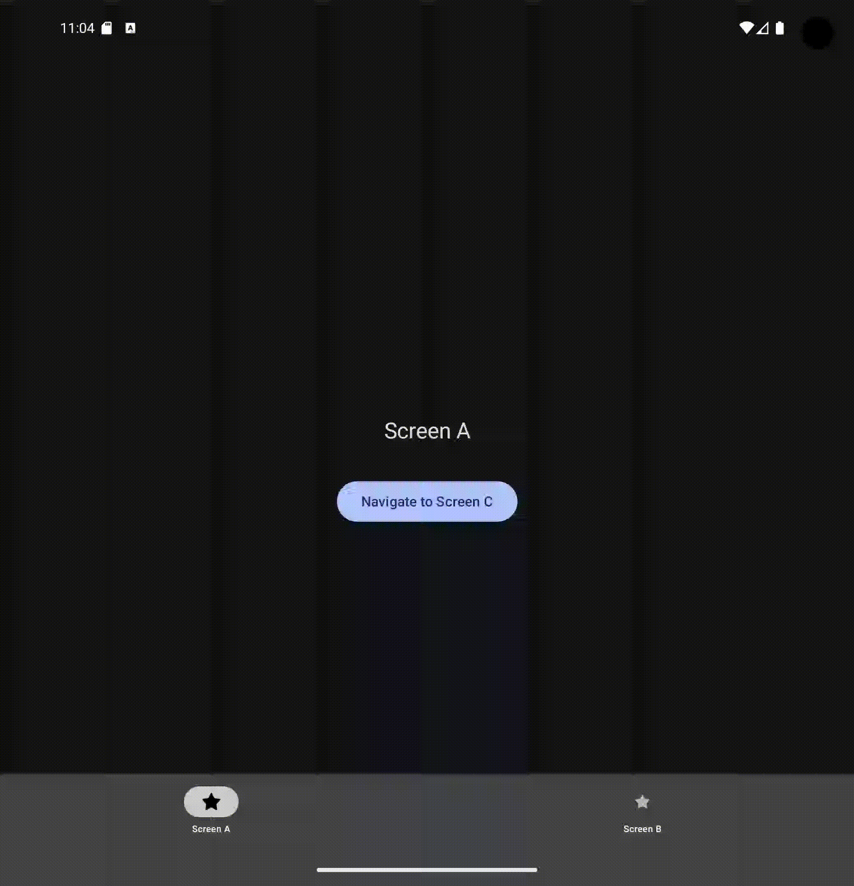

# Navigation 3 Compose

This repository provides a step-by-step tutorial for the **Navigation 3** library, a modern navigation solution designed specifically for **Jetpack Compose**. Navigation 3 offers developers complete control over the navigation back stack, simplifying the process to be as straightforward as managing a list.

> [!IMPORTANT]  
> For a detailed guide on the setup and implementation, check out my article on Medium:
>
> 👉 **[Navigation 3 - The new navigation for Jetpack Compose](https://medium.com/@nicosnicolaou/navigation-3-the-new-navigation-system-for-jetpack-compose-6dd26313aed6)** 👈

## ✨ Features

*   **Basic Setup:** Demonstrates the core setup for navigation state and the overall navigation system.
*   **Bottom Navigation:** Shows integration with a Bottom Navigation bar for primary app destinations.
*   **Animations:** Includes examples of screen transition animations with both global and per-screen configurations.
*   **Adaptive UI:** Supports adaptive navigation, allowing the UI to adjust to different screen sizes and layouts, such as for tablets and foldables.

## 🛠️ Tech Stack & Libraries

*   **UI:** [Jetpack Compose](https://developer.android.com/jetpack/compose)
*   **Navigation:** [Navigation 3](https://developer.android.com/guide/navigation/navigation-3)
*   **Language:** [Kotlin](https://kotlinlang.org)

## 🗺️ Navigation Example

This example demonstrates the following navigation paths:

- **Bottom Navigation**:
  - 📱 -> **Screen A** & **Screen B**
- **From Screen A**:  - ➡️ -> **Screen C**
- **From Screen B**:  - ➡️ -> **Screen D**

## 📸 Examples

|                   Navigation without Animation                    |                   Navigation with Animation                    |                            Adaptive Navigation                            |
|:-----------------------------------------------------------------:|:--------------------------------------------------------------:|:-------------------------------------------------------------------------:|
|  |  |  |

## 🔧 Versioning

*   **Navigation 3 Version:** **1.0.1**
*   **Target SDK:** **36**
*   **Minimum SDK:** **29**
*   **Kotlin Version:** **2.3.10**
*   **Gradle Version:** **9.0.1**

## 📚 References & Tutorials
*   [YouTube Tutorial: Jetpack compose navigation - Transitions](https://youtu.be/6L6GfvlmKj8?si=QFvKUxKXNmpY2oY9)
*   [Android Developers Blog: Jetpack Navigation 3 is Stable](https://android-developers.googleblog.com/2025/11/jetpack-navigation-3-is-stable.html)
*   [Official Documentation: Navigation 3 Guide](https://developer.android.com/guide/navigation/navigation-3)

## ⭐ Stargazers

If you enjoy this project, please give it a star!
Check out all the stargazers
here: [Stargazers on GitHub](https://github.com/NicosNicolaou16/Navigation_3_Compose/stargazers)

## 🙏 Support & Contributions

This project is actively maintained. Feedback, bug reports, and feature requests are welcome! Please feel free to **open an issue** or submit a **pull request**.